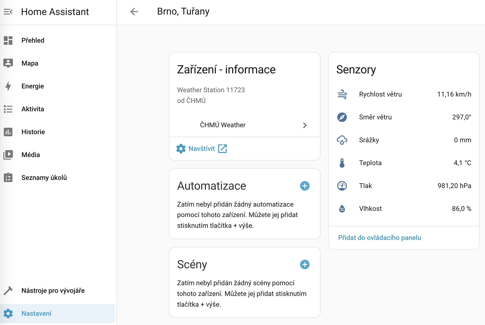

# ČHMÚ Weather Home Assistant Integration

🇨🇿 **Integrace pro Home Assistant poskytující data z meteorologických stanic Českého hydrometeorologického ústavu (ČHMÚ). Primárně určeno pro české uživatele z důvodu geografické dostupnosti stanic.**

🇬🇧 **Home Assistant integration providing weather data from Czech Hydrometeorological Institute (ČHMÚ) meteorological stations. Primarily intended for Czech audience due to the geographic proximity of weather stations.**



---

A Home Assistant integration to fetch weather data from ČHMÚ (Czech Hydrometeorological Institute).

[](https://github.com/hacs/integration)
[](https://github.com/lipelix/home-assistant-chmu-weather/releases)
[](https://github.com/lipelix/home-assistant-chmu-weather/actions/workflows/ci.yml/badge.svg)

## Installation

### HACS (Recommended)

1. Open HACS in your Home Assistant instance
2. Click on "Integrations"
3. Click the three dots in the top right corner
4. Select "Custom repositories"
5. Add this repository URL: `https://github.com/lipelix/home-assistant-chmu-weather`
6. Select category: `Integration`
7. Click "Add"
8. Find "ČHMÚ Weather" in the integration list and click "Download"
9. Restart Home Assistant
10. Go to Settings → Devices & Services → Add Integration
11. Search for "ČHMÚ Weather" and follow the configuration steps

### Manual Installation

1. Copy the `custom_components/chmu` directory to your Home Assistant `config/custom_components/` directory
2. Restart Home Assistant
3. Go to Settings → Devices & Services → Add Integration
4. Search for "ČHMÚ Weather" and follow the configuration steps

## Configuration

The integration is configured via the UI (Config Flow). No YAML configuration is needed.

## Features

- Fetches weather data from ČHMÚ stations
- Provides temperature, humidity, and other meteorological data
- Easy configuration through the Home Assistant UI

## Development

### Running Tests

To run the tests locally:

```bash
# Install development dependencies
pip install -r requirements-dev.txt

# Run tests
pytest tests/ -v
```

The test suite includes unit tests for API helpers and data parsing. Tests are automatically run via pre-commit hooks before each commit to ensure code quality.

### Code Quality

Before committing, ensure your code passes linting:

```bash
./lint.sh  # Runs ruff + HACS validation
```

Pre-commit hooks will automatically run ruff and pytest on commit. To set up pre-commit hooks:

```bash
pip install pre-commit
pre-commit install
```

## Support

If you have issues or questions, please:
- Check the [documentation](https://github.com/lipelix/home-assistant-chmu-weather)
- Open an [issue](https://github.com/lipelix/home-assistant-chmu-weather/issues)

## License

This project is licensed under the MIT License - see the [LICENSE](LICENSE) file for details.
