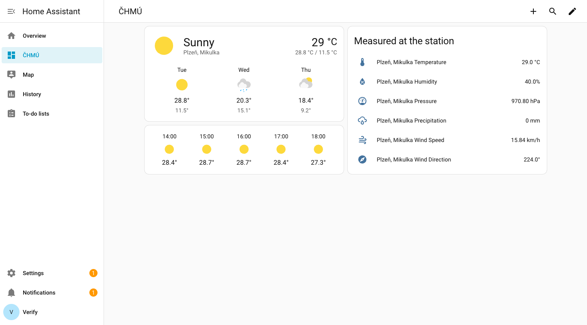
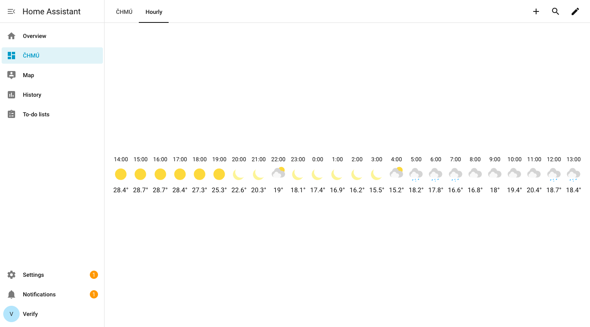

# ČHMÚ Weather Integration

Custom Home Assistant integration for Czech Hydrometeorological Institute (ČHMÚ) weather data.

## Features

- 🌡️ **Real-time weather data** from ČHMÚ meteorological stations
- 📊 **Multiple sensors**: Temperature, Humidity, Pressure, Precipitation, Wind Speed, Wind Direction, Weather Description
- 🌤️ **Weather entity with a per-station forecast** - 72 hours hourly plus 3 days daily, from the ALADIN 1 km model sampled at your station
- 📈 **Historical data support** via Home Assistant's built-in history tracking
- 🗺️ **41+ stations** across Czech Republic
- 🎯 **Smart station selection** - automatically suggests nearest station based on your Home location
- ⚡ **One-step setup** - pre-filled with recommended station

## Installation

1. Copy the `chmu` folder to your Home Assistant `custom_components` directory:
   ```
   homeassistant/
   └── custom_components/
       └── chmu/
   ```

2. Restart Home Assistant

3. Go to **Settings** → **Devices & Services** → **Add Integration**

4. Search for "ČHMÚ Weather" and select it

5. **Smart Selection** - The nearest weather station to your Home location will be automatically pre-selected

6. Confirm or choose a different station if you prefer

## Station Selection

The integration features **intelligent location-based selection**:

- 📍 Uses your Home Assistant location coordinates
- 🔍 Calculates distance to all available stations
- ✅ Pre-selects the nearest station automatically
- 📏 Shows distance to nearest station (in km)
- 🔄 Allows manual selection of any other station

**Example:**
- Your Home: Prague (50.08°N, 14.44°E)
- Nearest Station: **Praha-Ruzyně** (approximately 13.6 km away)
- Pre-selected automatically for one-click setup!

## Available Stations

**41+ professional meteorological stations** across Czech Republic, including:

- Cheb
- Karlovy Vary, Olšová Vrata
- Plzeň, Mikulka
- Praha-Ruzyně
- Brno-Tuřany
- Ostrava-Mošnov
- České Budějovice
- Hradec Králové
- Liberec
- Ústí nad Labem

...and many more! The integration will automatically suggest the nearest one to your home.

## Sensors

Each station provides the following sensors:

| Sensor | Unit | Device Class |
|--------|------|--------------|
| Temperature | °C | temperature |
| Humidity | % | humidity |
| Pressure | hPa | pressure |
| Precipitation | mm | precipitation |
| Wind Speed | m/s | wind_speed |
| Wind Direction | ° | - |
| Weather Description | text | - |

## Weather Entity

Alongside the sensors each station gets a `weather.` entity. Current conditions
are the station's own measurements; the forecast is the ČHMÚ ALADIN CZ_1km model
(about 1 km grid spacing) sampled at that station's coordinates.

| | |
|---|---|
| Hourly forecast | up to 72 hours |
| Daily forecast | 3 days, with the 12 hour high and low |
| Fields | condition, temperature, humidity, cloud cover, precipitation, wind speed and bearing |
| Refresh | hourly; the model itself runs at 00, 06, 12 and 18 UTC |



24 hours of the hourly forecast, with the day/night variants and the rain hours
the model predicts:



Use it with the standard weather card:

```yaml
type: weather-forecast
entity: weather.plzen_mikulka
forecast_type: daily
show_current: true
```

ČHMÚ publishes forecasts only as national prose or as roughly 70 MB of GRIB per
model run, neither of which an integration can download on every update. A
GitHub Actions job in this repository samples the GRIB at every station and
publishes a few kilobytes per station as a static site, which is what the
integration fetches. Nothing about the request is recorded: no accounts, no
analytics, no personal data. If that job ever stops, the integration warns after
12 hours and stops serving the forecast after 48; the measured sensors are
unaffected.

## Dashboard Configuration

### History Graph Card

Add to your dashboard to visualize weather trends:

```yaml
type: history-graph
entities:
  - entity: sensor.station_11406_temperature
    name: Venkovní teplota
  - entity: sensor.station_11406_humidity
    name: Venkovní vlhkost
  - entity: sensor.station_11406_pressure
    name: Tlak
  - entity: sensor.station_11406_precipitation
    name: Srážky
hours_to_show: 24
refresh_interval: 60
```

### Entity Card

Simple display of current values:

```yaml
type: entities
entities:
  - entity: sensor.station_11406_temperature
  - entity: sensor.station_11406_humidity
  - entity: sensor.station_11406_pressure
  - entity: sensor.station_11406_precipitation
  - entity: sensor.station_11406_wind_speed
  - entity: sensor.station_11406_wind_direction
title: ČHMÚ - Venkovní počasí
```

## Data Source

Data is fetched from ČHMÚ's Open Data portal:
- **API**: https://opendata.chmi.cz/meteorology/climate/
- **Forecast text API**: https://opendata.chmi.cz/meteorology/weather/forecast/now/
- **Forecast model**: https://opendata.chmi.cz/meteorology/weather/nwp_aladin/CZ_1km/
  (sampled per station and republished at
  https://lipelix.github.io/home-assistant-chmu-weather/v1/)
- **Update interval**: 10 minutes for measurements, 1 hour for the forecast
- **Data type**: Real measured values + text forecast description + per-station model forecast

## Troubleshooting

### No data showing

1. Check Home Assistant logs for errors
2. Verify internet connectivity
3. Try a different station
4. Wait 10 minutes for first data fetch

### Integration not visible

1. Ensure the `chmu` folder is in `custom_components/`
2. Restart Home Assistant
3. Clear browser cache

## Technical Details

- **Polling interval**: 10 minutes
- **Timeout**: 30 seconds per request
- **Fallback**: Simulated data if API unavailable (development mode)
- **API format**: JSON

## License

This integration uses public open data from ČHMÚ.

## Support

For issues and feature requests, visit: https://github.com/lipelix/home-assistant
